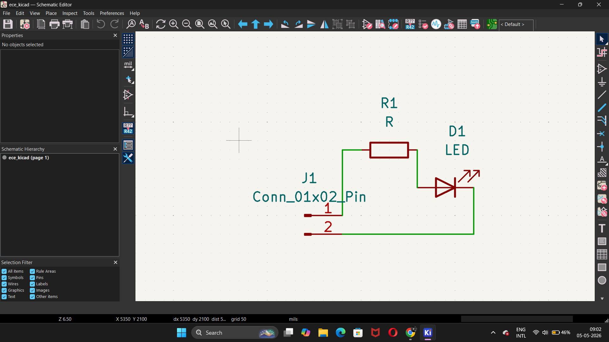
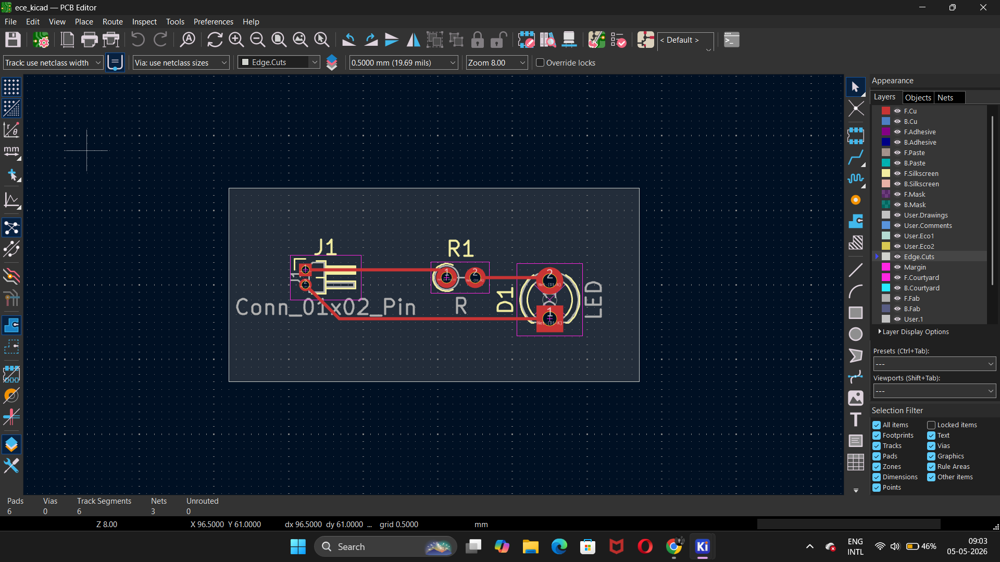
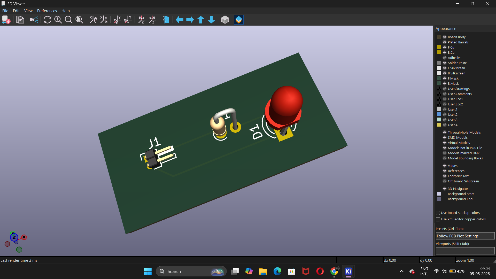

# 🔌 KiCad LED PCB Design

## 📌 Overview

This project demonstrates the design of a simple LED circuit PCB using KiCad.
It covers the complete workflow from schematic design to PCB layout and 3D visualization.

The circuit includes:

* A 2-pin connector for power input
* A current-limiting resistor
* A through-hole LED

---

## ⚙️ Features

* ✔ Schematic design using KiCad
* ✔ PCB layout and routing
* ✔ Through-hole components (THT)
* ✔ 3D visualization of the board
* ✔ Design Rule Check (DRC) verified

---

## 🧠 Circuit Description

This is a basic LED driving circuit:

Power → Resistor → LED → Ground

* The resistor limits current to protect the LED
* The LED turns on when power is applied

---

## 🛠️ Tools Used

* KiCad (EDA tool for schematic and PCB design)

---

## 📁 Project Structure

```
kicad-led-pcb-design/
│
├── images/
│   ├── schematic.png
│   ├── pcb_layout.png
│   └── 3d_view.png
│
├── project/
│   ├── ece_kicad.kicad_pro
│   ├── ece_kicad.kicad_sch
│   └── ece_kicad.kicad_pcb
│
├── README.md
└── LICENSE
```

---

## 🖼️ Preview

### 🔧 Schematic



### 🧩 PCB Layout



### 🧱 3D View



---

## 🚀 How to Use

1. Open the project in KiCad
2. Load the schematic file (`.kicad_sch`)
3. Open the PCB layout (`.kicad_pcb`)
4. Inspect routing and placement
5. Use the 3D viewer for visualization

---

## 📌 Notes

* This project is designed for learning basic PCB design
* Uses simple through-hole components for easy fabrication
* Can be extended into more complex hardware systems

---

## 🔮 Future Improvements

* Add microcontroller (Arduino / ESP32)
* Convert to SMD components
* Add voltage regulation
* Integrate sensors or control logic

---

## 📜 License

This project is open-source and available for learning and educational use.

---
